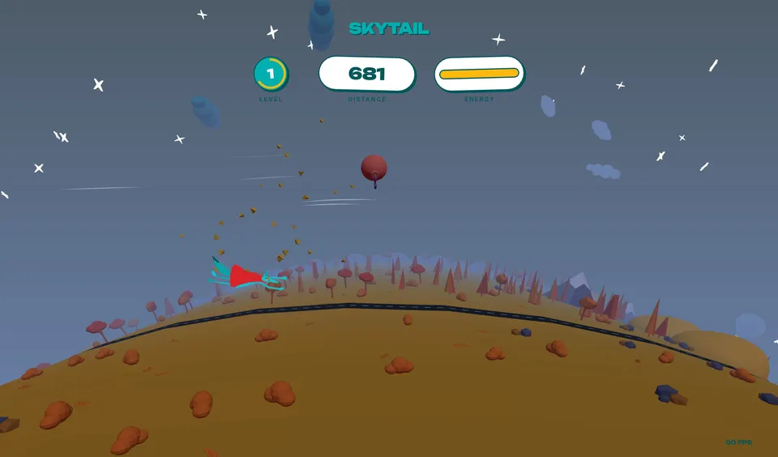
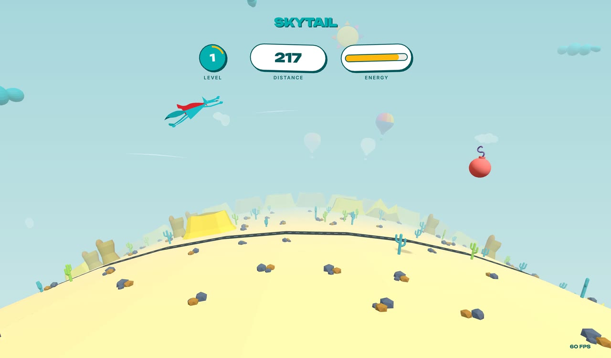
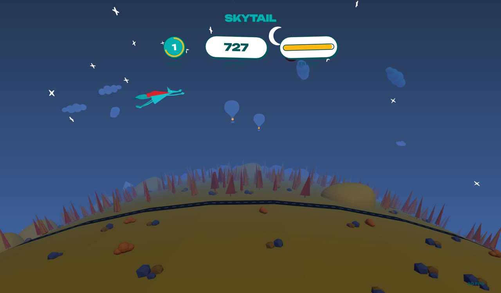
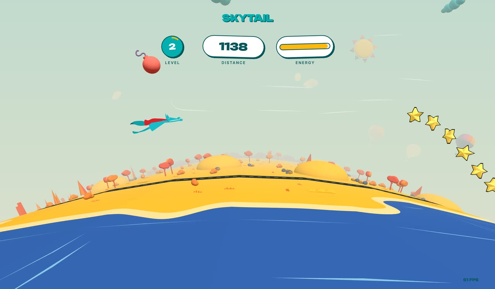
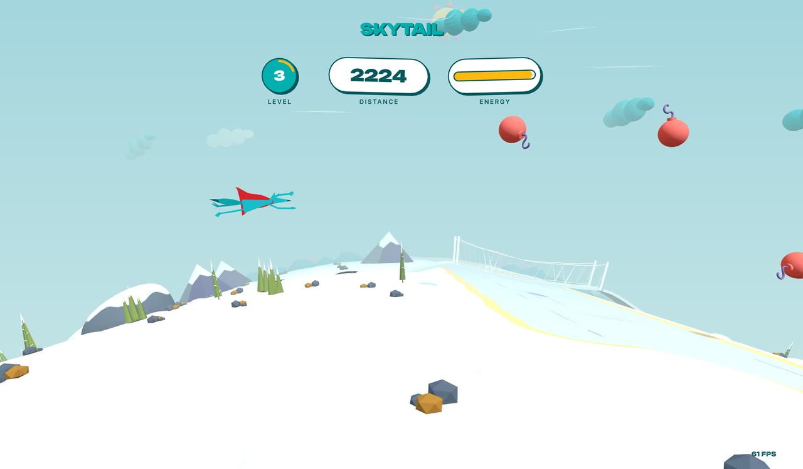
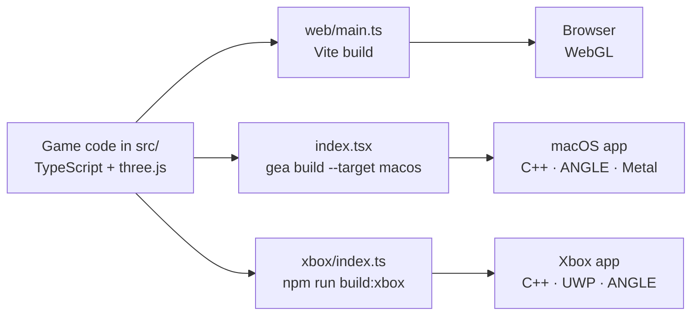

<p align="center">
  <a href="https://skytail.coyotiv.com">
    
  </a>
</p>

<h1 align="center">Skytail</h1>

<p align="center">
  <strong>An endless flight with the Coyotiv mascot.</strong><br>
  One TypeScript codebase. Runs in the browser, and compiles ahead of time to native macOS and Xbox apps with no JavaScript engine.
</p>

<p align="center">
  <a href="https://skytail.coyotiv.com"></a>
  <a href="https://github.com/geastack"></a>
  <a href="https://threejs.org/"></a>
  <a href="LICENSE"></a>
</p>

---

Fly over a ring-shaped world that is generated as you go. Collect yellow stars to
keep your energy up, dodge red bombs, and see how far you get. Each level is one
full day: you take off at dawn and fly through noon, dusk and a starlit night
before the sun comes up again.

Skytail builds on Karim Maaloul's 2016 Codrops tutorial
[The Aviator](https://github.com/yakudoo/TheAviator). It keeps the original game's
idea and rebuilds everything else: a deterministic world generator, a mascot that
moves on spring physics, a day-night sky, a reactive sound mix, and a native build
pipeline.

## Gallery

<table>
  <tr>
    <td width="50%"></td>
    <td width="50%"></td>
  </tr>
  <tr>
    <td align="center"><sub>Desert at noon</sub></td>
    <td align="center"><sub>Midnight. The stars come out and the balloon burners glow.</sub></td>
  </tr>
  <tr>
    <td width="50%"></td>
    <td width="50%"></td>
  </tr>
  <tr>
    <td align="center"><sub>An autumn coast on level 2</sub></td>
    <td align="center"><sub>Winter on level 3, with a suspension bridge on the right</sub></td>
  </tr>
</table>

## How to play

Your energy drains the whole time you fly. Each star gives back 3 points and each
bomb you hit takes 10. When your energy runs out, the game ends.

- **Steer** with the mouse, the arrow keys or WASD, or a gamepad's left stick.
  Gamepads work in the browser and on Xbox. Release the stick before you switch
  to the mouse or keyboard.
- **Start or replay** with Space, Enter, R, a click or the A button.
- **Do a barrel roll** with F or the Y button. Collect every star in a wave and
  the mascot rolls on its own.
- **Every 1,000 units of distance is a new level.** Speed rises during a level,
  then resets to a slightly higher starting speed at the next one. Each level
  sends bigger bomb waves.

## Under the hood

### One codebase, three platforms

The game, world, HUD and render loop live in [`src/`](src/) and are shared by
every platform. Each platform only adds a thin entry point.



- **The same three.js renderer on every platform.** On native builds,
  [`src/native-app.ts`](src/native-app.ts) creates a native WebGL 2 context and
  passes it to the unmodified three.js `WebGLRenderer`. GeaStack's
  [`@geastack/native-webgl-angle`](https://www.npmjs.com/package/@geastack/native-webgl-angle)
  host provides the context through ANGLE, which runs on Metal on macOS.
- **The window is TSX.** [`src/app.tsx`](src/app.tsx) builds the macOS view tree
  with `<NSView>` elements from `@geastack/apple`.
- **Web Audio without a browser.** The sound code uses standard Web Audio calls.
  On native builds, GeaStack provides a Web Audio-shaped graph engine: it renders
  through `AVAudioSourceNode` on macOS and XAudio2 on Xbox.
- **Text without a browser.** The browser version draws text with
  troika-three-text. Native builds swap in pre-baked glyph atlases for Inter and
  Unbounded.
- **Xbox renders at 4K.** [`xbox/three_uwp_main.cpp`](xbox/three_uwp_main.cpp) is
  a C++/CX app that renders at a fixed 3840×2160. It reads the gamepad through
  `Windows.Gaming.Input`.

### A world generated as you fly

[`src/worldgen/`](src/worldgen/) builds the world one cell at a time, just before
it comes into view.

- **Climate first.** Four noise fields (temperature, moisture, relief and detail)
  come from a custom 2D simplex noise with no permutation table.
- **Biomes in stretches.** The world is a chain of stretches, each 32 to 48
  columns wide. Temperature weights the biome choice: alpine leans cold and
  desert leans hot. An adjacency table keeps neighbours sensible, so desert never
  borders conifer forest. Borders wander along noise-warped lines, and the ground
  colour, tree density and species blend across them.
- **Seasons roll across the map.** Each season lasts 400 columns. Snow cover is
  computed from the climate temperature, the season and the biome.
- **Regions with a plan.** Every 64 columns there's a chance of a river with a
  suspension bridge where the road crosses it, and a campsite with tents, log
  seats and a campfire. The road winds through a dry corridor and joins up
  across region borders.
- **A skyline that never breaks.** Distant ridges and mesas are placed so that
  each border has exactly one owner, which leaves no gaps on the horizon.

## Run it in your browser

You need [Node.js](https://nodejs.org/) 22.15 or later.

```sh
git clone https://github.com/coyotiv/skytail.git
cd skytail
npm ci
npm --prefix web ci
npm run dev
```

Open the local URL that Vite prints.

The browser version lives in [`web/`](web/) and has its own `package.json`. That
is why there are two install commands.

To make a production build in `web/dist/` and preview it:

```sh
npm run build
npm run preview
```

## Build the macOS app

You need the Xcode Command Line Tools (`xcode-select --install`). Run this from
the repository root:

```sh
npx gea build --target macos
open dist/macos/skytail/Skytail.app
```

`gea` is the GeaStack CLI. It compiles the game, three.js included, to C++ and
builds a native app. The first build can take 15 minutes or more.

## Build for Windows

Skytail runs as a Win32 desktop app on Direct3D 12 through
[threejs-rendozer](https://github.com/geastack/threejs-rendozer): three.js's
WebGL calls go to an OpenGL ES implementation on General Arcade's rendozer,
with no OpenGL driver involved. You need, on Windows 10 or 11:

- Node.js 22 or later, and git
- Visual Studio 2022 or later, or the Build Tools, with the "Desktop development
  with C++" workload and its Clang, CMake and Ninja components
- checkouts of `threejs-rendozer` and `rendozer` next to this one

Run this from the repository root:

```sh
npm ci
node windows/build-windows.mjs
```

The script generates the game's C++, fetches glslang and SPIRV-Cross at pinned
commits, builds `windows/build/skytail/Skytail/Skytail.exe` with the DLLs it
needs next to it, and puts a Skytail shortcut on the desktop (`--no-shortcut`
skips that). Pass `--threejs-rendozer <dir>` or `--rendozer <dir>` if the
checkouts live elsewhere. The first build can take 30 minutes or more.

## Build for Xbox

Xbox builds run on a remote Windows build host and are installed on an Xbox in
Developer Mode. The local machine needs bash, SSH, SCP and tar. The Windows build
host needs:

- Visual Studio 2026 with the C++ and UWP tools
- clang-cl and CMake
- Windows SDK 10.0.26100.0
- The UWP ANGLE DLLs `libEGL.dll`, `libGLESv2.dll` and `d3dcompiler_47.dll`

Build with your own host and directories:

```sh
npm run build:xbox -- --host build-host --remote-dir C:/skytail-build --angle-dir C:/uwp-angle
```

- `--host` is the SSH host of the Windows build machine.
- `--remote-dir` is the build directory on that host. Use an absolute path with
  forward slashes and no spaces.
- `--angle-dir` is the directory on that host that contains the UWP ANGLE DLLs.

You can also set `GEA_XBOX_BUILD_HOST`, `GEA_XBOX_BUILD_DIR` and
`GEA_XBOX_ANGLE_DIR` instead of passing the flags.

To only generate and stage the build inputs locally, without the remote build:

```sh
npm run build:xbox -- --stage-only
```

To install and start the game on your Xbox, set `GEA_XBOX_AUTH` to your Device
Portal credentials as `username:password`, then run:

```sh
npm run deploy:xbox -- --xbox xbox-address
```

You can set `GEA_XBOX_HOST` instead of passing `--xbox`.

## Development

| Command                      | What it does                                   |
| ---------------------------- | ---------------------------------------------- |
| `npm run dev`                | Starts the browser version with live reload    |
| `npm test`                   | Runs the unit tests with Vitest                |
| `npm run check`              | Type-checks the game                           |
| `npm run check:native`       | Type-checks the code used by the native builds |
| `npm --prefix web run check` | Type-checks the browser entry point            |

The code is in [`src/`](src/):

| Directory                    | Contents                                                    |
| ---------------------------- | ----------------------------------------------------------- |
| [`game/`](src/game/)         | Game loop, energy, levels, and star and bomb waves          |
| [`actors/`](src/actors/)     | The flying mascot, stars, bombs and particles               |
| [`world/`](src/world/)       | Terrain ring, sky, lighting, wind and the day-night cycle   |
| [`worldgen/`](src/worldgen/) | Procedural generation of terrain, roads, rivers and scenery |
| [`hud/`](src/hud/)           | Title screen, distance, energy and level display            |
| [`io/`](src/io/)             | Input and audio                                             |
| [`kit/`](src/kit/)           | The 121 embedded low-poly models                            |
| [`config.ts`](src/config.ts) | Gameplay tuning values such as speed, distances and pools   |

The browser entry point is [`web/main.ts`](web/main.ts). The native entry point
is [`index.tsx`](index.tsx). The Xbox host code is in [`xbox/`](xbox/).

## Credits

Skytail builds on [The Aviator](https://github.com/yakudoo/TheAviator) by Karim
Maaloul, published with
[Codrops](https://tympanus.net/codrops/2016/04/26/the-aviator-animating-basic-3d-scene-threejs/)
in 2016.

The models and favicon come from [Coyotiv](https://coyotiv.com). The audio was
generated with ElevenLabs. The native builds are made with
[GeaStack](https://github.com/geastack).

## License

The code is [MIT](LICENSE) licensed. Third-party source credits and license terms
are in [LICENSE.third-party](LICENSE.third-party). The Inter and Unbounded font
licenses are in [LICENSE.fonts](LICENSE.fonts).
